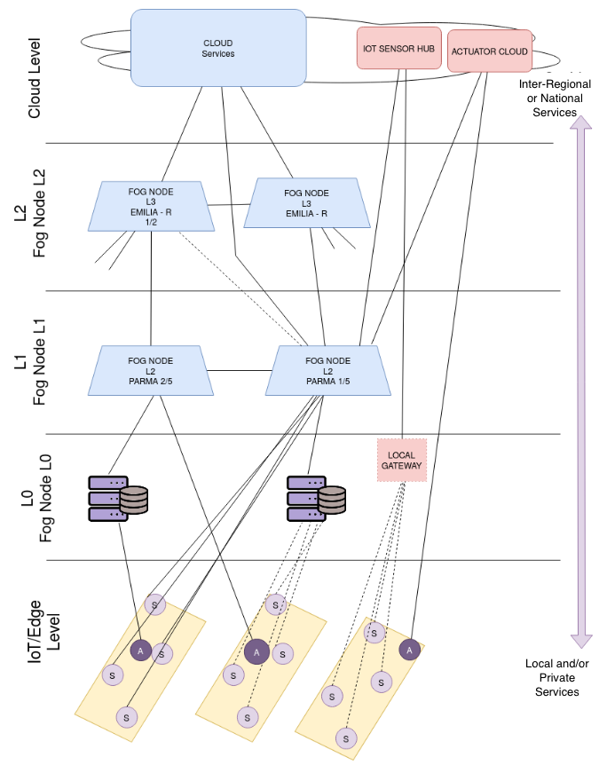

# "Fog Computing in Precision Agricolture" scenario simulation

## Introduction
The goal of the simulation is to test both a *Fog Computing* architecture for *precision agricolture* and a large-scale network simulation with the fog computing simulator, i.e [YAFS](https://github.com/acsicuib/YAFS).

## Topology and Architecture description
The reference architecture simulated is shown below:

Precision agricolture has a lot of needs, in this study case reduced to *data production* (from sensors), *data processing* (from Fog Nodes and Cloud) and *communication with actuators* (valve, tractors, etc.).

As shown in the figure above, devices are located into layers, starting from the bottom with nodes that offers none or few services to the network but generates massive amount of data, to the top layer with nodes that don't produce data but provide services and computanioal power to the network. In addition, speaking about reachability, the lower the level and the more the node will be reached from limited and circumscribed areas, and also from the physical point of view will be present in the reference territory (guaranteeing low latencies).

### Architecture and layer description

 * **IoT/Edge Layer** 
    This layer is made of all sensors and actuators that are located into IoT area, having an extremely low computational power, power supply problems, discontinuity in data production and mobility. 
    Devices involved in this layer works with low payload protocols, low consumption and hight sleep time. In this layer are located Edge nodes, too. The definition of these nodes in the literature varies a lot, in general they can be defined as nodes, to the edge of the network, in which a small elaboration of the data is carried out.
 * **Fog L0 Layer** 
    Here we insert services that do not fall within the IoT level below, but that do not generally offer services to the network (i.e act mostly as a client), but only to private users. They are, for example, farm-level servers that monitor private sensors and/or actuators.
* **Fog L1 Layer** 
    Nodes that provide services and collect and aggregate data from different companies. A possible area of interest is at the provincial or sub-provincial level. These nodes offer several services to the network, for the underlying nodes and for both the overlying ones. For example, for the underlying nodes it deals with data collection, maintenance and historical consultation, communication with actuators, etc. At levels above it offers communication of data (even or only aggregates and anonymous) e.g for data processing.
* **Fog L2 Layer** 
    Nodes dealing with regional or sub-regional geographical areas. They have larger processing capabilities than the underlying level and can therefore also perform heavier tasks such as statistical analysis of aggregated data. They also offer more complex pre-processing at the level above (e.g. distributed ML algorithms).
* **Cloud Layer** 
    Here you will find several services controlled by sensor manufacturers or organizations that interface with sensors and actuators. In addition, there are also services for the management of the application that we try to simulate, which for example deal with training and running very heavy ML algorithms.

## Simulation definition and implementation

In this section device types, message formats and trasmission rate along the network will be defined, taking a look at the Python code, explaining it.  